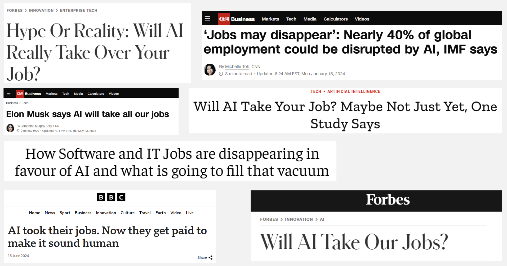

# Reddit Data Analysis Project for SFI Complexity Global School 2024 

### Table of Contents
- [Reddit Data Analysis Project for SFI Complexity Global School 2024](#reddit-data-analysis-project-for-sfi-complexity-global-school-2024)
    - [Table of Contents](#table-of-contents)
  - [Overview](#overview)
  - [Methodology](#methodology)
    - [Data Collection](#data-collection)
      - [Reddit API and Archive](#reddit-api-and-archive)
      - [Subreddits and Queries](#subreddits-and-queries)
    - [Data Preprocessing](#data-preprocessing)
    - [Data Labeling](#data-labeling)
    - [Machine Learning Models](#machine-learning-models)
      - [Models Used](#models-used)
      - [Preprocessing](#preprocessing)
      - [Model Performance](#model-performance)
    - [Exploratory Data Analysis (EDA)](#exploratory-data-analysis-eda)
    - [Topic Modeling](#topic-modeling)
  - [Results and Findings](#results-and-findings)
  - [Read Report](#read-report)
  - [Usage](#usage)
    - [Get data form Reddit API](#get-data-form-reddit-api)
    - [Download data and upload to HPC](#download-data-and-upload-to-hpc)
    - [Data preprocessing](#data-preprocessing-1)
  - [Future Work](#future-work)
  
## Overview
This project involves extracting data (more than 2TB) from Reddit, preprocessing it, and analyzing it using machine learning models to understand discussions around AI and employment. The analysis includes data collection, preprocessing, model training, and topic modeling. It was done using the Old Dominion University HPC.
This project was part of the [SFI CGS 2024](https://www.sfi.ie/cgs/cgs-2024/) project.

## Methodology
### Data Collection

#### Reddit API and Archive
- Due to API limitations, we used the Reddit data archive accessible via torrents.
- Data spans from 2005 to 2023, focusing on posts from July 2022 to July 2024.
- Downloaded using academic torrents and processed using scripts from the PushshiftDumps repository.
- Total number of posts extracted: **7,616,585.**
- 
#### Subreddits and Queries
- Subreddits: anti-work, AskReddit, careerguidance, changemyview, Economics, Futurology, jobs, NoStupidQuestions, Showerthoughts, technology.
- Query: Filtered posts discussing AI's impact on jobs.

### Data Preprocessing
- Used scripts from the PushshiftDumps repository.
- Decompressed and iterated over zst compressed files.
- Converted compressed files into CSV and queried them for specific subreddits and months.

### Data Labeling
- Manually labeled 555 Reddit posts into three categories:
  1. **C1 Work**: Task-oriented discussions.
  2. **C2 Worker**: Impact on individual workers.
  3. **C3 Workforce**: Impact on large groups or sectors.

### Machine Learning Models
#### Models Used
- Random Forest Classifier
- Support Vector Machine (SVM)

#### Preprocessing
- Text data cleaned and transformed using TF-IDF vectorization.
- Models trained using multilabel classification.

#### Model Performance
- Random Forest performed better for C2 Worker category.
- SVM showed limited effectiveness across all categories.

### Exploratory Data Analysis (EDA)
- Time series analysis to identify trends over time.
- Sentiment analysis using TextBlob to assess emotional tone.

### Topic Modeling
- Conducted using Latent Dirichlet Allocation (LDA) on various datasets.
- Analyzed topics for C1 Work, C2 Worker, and C3 Workforce categories.

## Results and Findings
- Number of posts matching queries: 7,616,585.
- Posts labeled by Llama 3.1 7B: 18,159.
- Manual labeling identified 67 in C1, 192 in C2, and 80 in C3.

- AI's impact on employment is a central theme.
- Discussions on human vs. AI creativity, especially in art.
- Ethical and societal considerations are significant topics.

## Read Report
📄 [Human Agency in Automated Futures](docs/Human%20agency%20in%20automated%20futures.pdf) - Full research report detailing methodology, findings, and conclusions.

##  Usage
### Get data form Reddit API
- Use Torrent to download the data (predicted to be ~2TB).
- Use the command `at-get 9c263fc85366c1ef8f5bb9da0203f4c8c8db75f4` to download the data from the [2005-2023](https://academictorrents.com/details/9c263fc85366c1ef8f5bb9da0203f4c8c8db75f4) dataset.
- [2005-2023](https://academictorrents.com/details/9c263fc85366c1ef8f5bb9da0203f4c8c8db75f4)
- [All (until 2024-07)](https://github.com/ArthurHeitmann/arctic_shift/blob/master/download_links.md)

### Download data and upload to HPC 
  1. Command used to split files in Windows: https://github.com/anseki/split-win/tree/master. Download the .cmd and .ps1 files to System32/. 
  2. Use the command `split D:\REDDIT_DATA\reddit\submissions\RS_2023-12.zst -size 1gb` to split the files. HPC's limit is 10GB, uploading 1GB parts works the best.
  3. In the HPC Create a folder with the name of the file and upload all the parts there. For instance `RS_2023-12/`
  4. Use the command `cat /home/jmart130/GitHub/SFI_CGS_2024/data/reddit/submissions/RS_2023-12/* > /home/jmart130/GitHub/SFI_CGS_2024/data/reddit/submissions/RS_2023-12.zst` to join the files in the HPC files.

### Data preprocessing
Use the files from this [repository](https://github.com/Watchful1/PushshiftDumps) to preprocess the data.
     1. `single_file.py` decompresses and iterates over a single zst compressed file.
     2. `iterate_folder.py` does the same, but for all files in a folder.
     3. Queries:
      - Getting 1 subreddit: `python combine_folder_multiprocess.py reddit/submissions --field subreddit --value careerguidance --output pushshift2 --processes 20 --file_filter "^RS_2024-07"`
      - Getting all subreddits: `python combine_folder_multiprocess.py reddit/submissions --field subreddit --value anti-work,AskReddit,careerguidance,changemyview,Economics,Futurology,jobs,NoStupidQuestions,Showerthoughts,technology --output all_subreddits_2024-04 --file_filter "^RS_2024-04"`
      4. Use `filter_file.py` to convert the compressed .zst files into csv.
      5. Use `query_csv.py` to query the csv files for each month and subreddit into only one.
      6. Use `get_sample.py` to get a sample of the data either by month or by subreddit (proportionally).

## Future Work
- Improve lemmatization and stopword reduction.
- Check error metrics (BIC, AIC) for topic merging.
- Tokenize using bigrams and trigrams.
- Document hyperparameter selection for models.